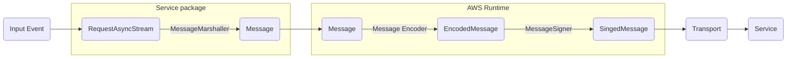
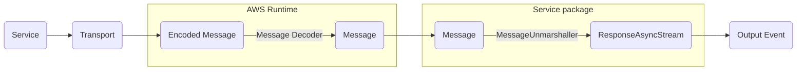

# Event Stream

* Proposal: [RFC-00001](design/rfc-00001-event-stream.md)
* Authors: [Ganesh Jangir](https://github.com/ganeshnj)
* Status: **Review**

## Introduction

This proposal covers the client interface to be generated for request and
responses with event stream payloads. See the Smithy [event stream
spec](https://smithy.io/2.0/spec/streaming.html#event-streams)

## Motivation

An event stream is an abstraction that allows sending messages asynchronously
between client and server. Event stream can be unidirectional (simplex) or
duplex (bidirectional). AWS Services such as [Transcribe
Streaming](https://docs.aws.amazon.com/transcribe/latest/APIReference/API_streaming_StartStreamTranscription.html),
[Lex](https://docs.aws.amazon.com/lexv2/latest/dg/API_runtime_StartConversation.html),
[Kinesis](https://docs.aws.amazon.com/kinesis/latest/APIReference/API_SubscribeToShard.html)
and
[S3](https://docs.aws.amazon.com/AmazonS3/latest/API/API_SelectObjectContent.html)
use event stream to send messages to clients. This proposal is to add idiomatic
support for event stream to the Swift SDK.

## Proposed solution

The proposed solution is to generate a client interface that allows the user to
interact with the Smithy event stream. It uses `AsyncSequence` to represent both
request and response event stream types.

Simplex (unidirectional) events can be streamed over HTTP1.1 and HTTP2.0. Duplex
(bidirectional) events require HTTP2.0. WebSockets can be used to stream
bidirectional events over HTTP1.1 but this is not supported by the SDK.

### Use Case 1: Client to Server

```
public struct PublishMessageInput {
    let room: String
    let messages: AsyncRequestStream<PublishEvents>
}
```

Users can instantiate `AsyncRequestStream<PublishEvents>` with
`AsyncThrowingStream` and send messages to the server.

```
let stream = AsyncThrowingStream<PublishEvents, Error> { continuation in
    Task {
        for i in 0..<10 {
            continuation.yield(PublishEvents.message(.init(message: "\(i)")))
        }
        
        continuation.yield(PublishEvents.leave(.init()))
        continuation.finish()
    }
}

let publishInput = PublishMessageInput(room: "test-room", messages: AsyncRequestStream<PublishEvents>(stream))
```

### Use Case 2: Server to Client

```
public struct SubscribeToMovementsOutput {
    let movements: AsyncResponseStream<MovementEvents>
}
```

Users can iterate over the `AsyncResponseStream<MovementEvents>` to receive
messages from the server.

```
for try await movement in subscribeOutput.movements {
    print("Received movement: \(movement)")
}
```

### Use Case 3: Bidirectional

This is combination of case 1 and 2, both `Input` and `Output` structs contain
stream which can be asynchronously write and read respectively.

```
let stream = AsyncThrowingStream<FizzBuzz, Error> { continuation in
    Task {
        for i in 1...15 {
            if i % 15 == 0 {
                continuation.yield(.fizzBuzz(FizzBuzz()))
            } else if i % 3 == 0 {
                continuation.yield(.fizz(Fizz()))
            } else if i % 5 == 0 {
                continuation.yield(.buzz(Buzz()))
            } else {
                continuation.yield(.number(i))
            }
        }
        continuation.finish()
    }
}

let fizzBuzzInput = FizzBuzzInput(fizzBuzz: AsyncRequestStream<FizzBuzz>(stream))
let fizzBuzzOutput = try await client.fizzBuzz(input: fizzBuzzInput)
for try await fizzBuzz in fizzBuzzOutput.fizzBuzz {
    print("Received fizzBuzz: \(fizzBuzz)")
}
```

## Detailed design

### Typical flow of events

#### Client to Server



#### Server to Client



### Smithy model

```
namespace smithy.example

operation PublishMessages {
    input: PublishMessagesInput
}

@input
structure PublishMessagesInput {
    room: String,
    messages: PublishEvents,
}

@streaming
union PublishEvents {
    message: Message,
    leave: LeaveEvent,
}

structure Message {
    message: String,
}

structure LeaveEvent {}
```

**Event stream on an output**

```
namespace smithy.example

operation SubscribeToMovements {
    input: SubscribeToMovementsInput,
    output: SubscribeToMovementsOutput
}

@input
structure SubscribeToMovementsInput {}

@output
structure SubscribeToMovementsOutput {
    movements: MovementEvents,
}

@streaming
union MovementEvents {
    up: Movement,
    down: Movement,
    left: Movement,
    right: Movement,
    throttlingError: ThrottlingError
}

structure Movement {
    velocity: Float,
}

/// An example error emitted when the client is throttled
/// and should terminate the event stream.
@error("client")
@retryable(throttling: true)
structure ThrottlingError {}
```

**Event stream on both input and output**

```
operation FizzBuzz {
    input: FizzBuzzInput,
    output: FizzBuzzOutput
}

@input
structure FizzBuzzInput {
    fizzBuzz: FizzBuzzEvents,
}

@output
structure FizzBuzzOutput {
    fizzBuzz: FizzBuzzEvents,
}

@streaming
union FizzBuzzEvents {
    fizz: Fizz,
    buzz: Buzz,
    fizzBuzz: FizzBuzz,
    number: Int,
}

structure Fizz {
}

structure Buzz {
}

structure FizzBuzz {
}
```

### Request and Response streams

The members of an operation input or output with an event stream trait are
represented with an
[`AsyncSequence`](https://developer.apple.com/documentation/swift/asyncsequence).
`AsyncSequence` is natural fit for representing asynchronous streams of data.
Swift SDK already uses `AsyncSequence` for pagination. 

`ClientRuntime` adds two new types `AsyncRequestStream` and
`AsyncResponseStream` which wraps the underlying event stream. This allows to
decouple the implementation with public APIs. Currently, the underlying event
stream is a
[`AsyncThrowingStream`](https://developer.apple.com/documentation/swift/asyncthrowingstream)
which is a `AsyncSequence` that can throw errors. 


```
/// Type used to stream events from client to server
public struct AsyncRequestStream<Element>: AsyncSequence {
    typealias Element = Element

    internal let stream: AsyncThrowingStream<Element, Error>

    init(_ stream: AsyncThrowingStream<Element, Error>) {
        self.stream = stream
    }
    
    func makeAsyncIterator() -> Iterator {
        return AsyncIterator(iterator: stream.makeAsyncIterator())
    }

    struct Iterator: AsyncIteratorProtocol {
        var iterator: AsyncThrowingStream<Element, Error>.Iterator

        init(iterator: AsyncThrowingStream<Element, Error>.Iterator) {
            self.iterator = iterator
        }

        mutating func next() async throws -> Element? {
            let element = try await iterator.next()
            return element
        }
    }
}
```

```
/// Type used to stream events server to client
public struct AsyncResponseStream<Element>: AsyncSequence {
    typealias Element = Element

    internal let stream: AsyncThrowingStream<Element, Error>

    public init(_ stream: AsyncThrowingStream<Element, Error>) {
        self.stream = stream
    }
    
    func makeAsyncIterator() -> Iterator {
        return AsyncIterator(iterator: stream.makeAsyncIterator())
    }
    
    struct Iterator: AsyncIteratorProtocol {
        var iterator: AsyncThrowingStream<Element, Error>.Iterator

        init(iterator: AsyncThrowingStream<Element, Error>.Iterator) {
            self.iterator = iterator
        }

        mutating func next() async throws -> Element? {
            return try await iterator.next()
        }
    }
}
```

### Input and output types

`@streaming` trait on a union indicates that the union is an event stream.

For input types, the union member is represented as an `AsyncRequestStream<T>`
of the union member type.

```
public struct PublishMessageInput {
    let room: String
    let messages: AsyncRequestStream<PublishEvents>
}

public enum PublishEvents {
    case message(Message)
    case leave(LeaveEvent)
}

public struct Message {
    let message: String
}
```

For output types, the union member is represented as an `AsyncResponseStream<T>`
of the union member type.

```
public struct SubscribeToMovementsOutput {
    let movements: AsyncResponseStream<MovementEvents>
}

public enum MovementEvents {
    case up(Movement)
    case down(Movement)
    case left(Movement)
    case right(Movement)
}

public struct Movement {
    let velocity: Float
}
```

For bidirectional case, both Input and Output structs have streams.

```
struct FizzBuzzInput {
    let fizzBuzz: AsyncRequestStream<FizzBuzz>
}

struct FizzBuzzOutput {
    let fizzBuzz: AsyncResponseStream<FizzBuzz>
}

enum FizzBuzz {
    case fizz(Fizz)
    case buzz(Buzz)
    case fizzBuzz(FizzBuzz)
    case number(Int)
}

struct Fizz {
}

struct Buzz {
}

struct FizzBuzz {
}
```

#### Event stream errors

Event stream may target shapes marked with the error trait. These events are
terminal and stream is terminated after the error is received. When an operation
throws an event stream error, they are thrown as modeled `Swift.Error` type
rather than an event type. 

```
public enum MovementEventsError: Error {
    case throttlingError(ThrottlingError)
}
```

This allows idiomatic Swift error handling with `do-catch` blocks.

```
let output = try await client.subscribeToMovements(input: input)
do {
    for try await event in output.movements {
        switch event {
        case .up(let movement):
            print("up: \(movement)")
        case .down(let movement):
            print("down: \(movement)")
        case .left(let movement):
            print("left: \(movement)")
        case .right(let movement):
            print("right: \(movement)")
    }
} catch MovementEventsError.throttlingError(let error) {
    print("error: \(error)")
} 
```

### Client APIs

Similar to the existing client APIs, the client APIs for event stream are
generated as async operations that takes an input and returns an output.

```
public protocol ExampleService {
    func publishMessage(input: PublishMessageInput) async throws
    func subscribeToMovements(input: SubscribeToMovementsInput) async throws -> SubscribeToMovementsOutput
    func fizzBuzz(input: FizzBuzzInput) async throws -> FizzBuzzOutput
}
```

Example usage of request stream

```
let stream = AsyncThrowingStream<PublishEvents, Error> { continuation in
    Task {
        for i in 0..<10 {
            continuation.yield(PublishEvents.message(.init(message: "\(i)")))
            // artificial delay
            let waitTime = Double.random(in: 0.1...2)
            try await Task.sleep(nanoseconds: UInt64(waitTime * 1_000_000_000))
        }
        // for illustration purposes
        // continuation.finish(throwing: ThrottlingError())
        
        continuation.yield(PublishEvents.leave(.init()))
        continuation.finish()
    }
}

let publishInput = PublishMessageInput(room: "test-room", messages: AsyncRequestStream<PublishEvents>(stream))

try await client.publishMessage(input: publishInput)
```

Example usage of response stream

```
let subscribeInput = SubscribeToMovementsInput()
let subscribeOutput = try await client.subscribeToMovements(input: subscribeInput)
for try await movement in subscribeOutput.movements {
    print("Received movement: \(movement)")
}
```

### Event Stream messages

Event Stream Message is the type define in `ClientRuntime` that is sent over the
wire. It contains the following properties:

* `headers` - a map of headers that are sent with the message
* `payload` - the payload of the message. This is a union of all the possible
  event types that can be sent over the wire. 

```
public struct Message {
    let headers: Headers
    let payload: Data
}
```

#### Message marshallers/unmarshallers

`MessageMarshaller` and `MessageUnmarshaller` are defined in `ClientRuntime`.
Their implementations are operation specific and code-generated in service
packages. They are responsible for converting high level event to a `Message`
and vice versa. 

```
internal protocol MessageMarshaller {
    associatedtype Event
    func marshall(event: Event) throws -> Message
}
```

```
internal protocol MessageUnmarshaller {
    associatedtype Event
    func unmarshall(message: Message) throws -> Event
}
```

#### Message Encoder/Decoder

`MessageEncoder` and `MessageDecoder` are defined in `ClientRuntime`. AWS
services use `vnd.amazon.eventstream` binary format to send event stream
messages over the wire. `AWSClientRuntime` implements both protocols that are
responsible for encoding and decoding the `Message` type to and from the wire
format. Read more about the event stream message format
[here](https://docs.aws.amazon.com/transcribe/latest/dg/streaming-setting-up.html). 


```
internal protocol MessageEncoder {
    func encode(message: Message) throws -> Data
}
```

```
internal protocol MessageDecoder {
    func decode(data: Data) throws -> Message
}
```

#### Message Signer

`MessageSigner` is defined in `ClientRuntime` and implemented in
`AWSClientRuntime`. Every message sent over the wire is signed. `Authorization`
header is added to the message with the signature. The `MessageSigner` is
responsible for signing the message.  `SigV4` is supported for event stream
messages. For chained signing, the signer is responsible for signing the message
with the signature from the previous signed message.

```
internal protocol MessageSigner {
    func sign(message: Message) throws -> Message
}
```

### CRT requirements

1. HTTP2.0 bindings: For duplex streaming HTTP2.0 is required, which is
   supported by the CRT but not yet exposed in the SDK through bindings.
2. `MessageEncoder` and `MessageDecoder`: CRT has `vnd.amazon.eventstream`
   binary format encoding and decoding implementations. These need to be exposed
   in the SDK through bindings. This is not a hard requirement but good to have
   if we want to avoid code duplication.

## Source compatibility

This change fixes the broken event stream operations, otherwise, this change is
additive and there should be no affect on existing source.

## Alternatives considered

**Alternative 1:** Use `AsyncStream` for both request and response types

This couples the implementation with public APIs. We'd not be able to change the
underlying implementation without breaking the public APIs. It would also
require major version bump.
